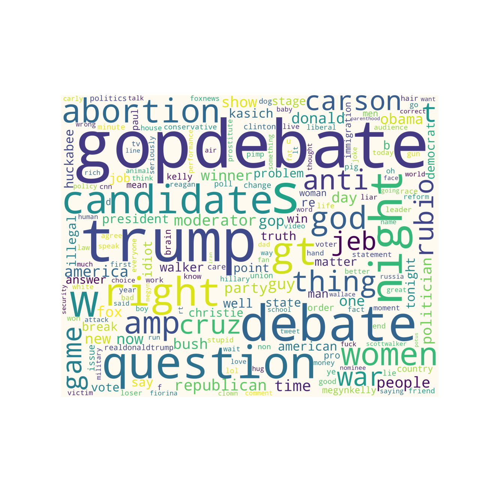

# WordCloud Demo
_This project demonstrates wordcloud feature_

> Word Cloud is a data visualization technique used for representing text data in which 
> the size of each word indicates its frequency or importance. Significant textual data points 
>can be highlighted using a word cloud. Word clouds are widely used for analyzing data 
>from social network websites.

##### Libraries

 - sqlalchemy = 1.4.23
 - wordcloud = 1.8.1
 - numpy==1.19.5
 - pandas==1.1.5
 - matplotlib==3.3.4

##### Installation steps:

1. Clone the repository
2. Create virtual enviornment

> virtualenv -p python3.6 venv_wc_demo
>
> .venv_wc_demo/bin/activate

3. Install dependencies/packages:

> pip install -r requirements.txt

4. Run the following command:

>  python sql_convertor.py 
>  python word_cloud.py

##### Word cloud Example

